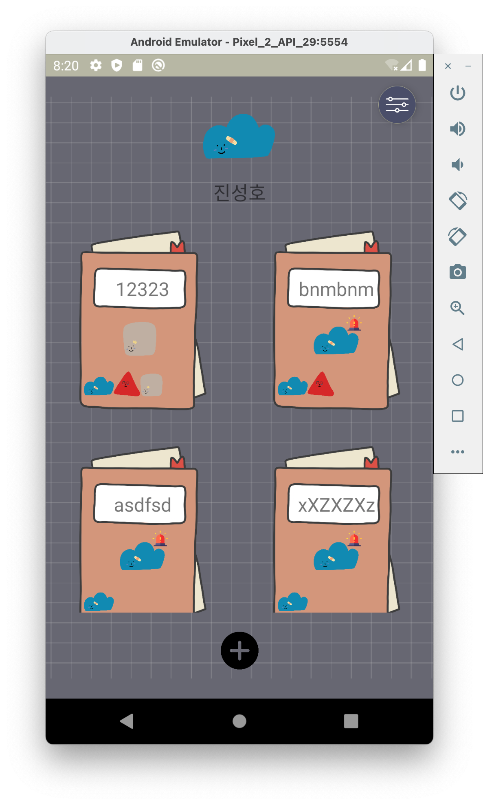
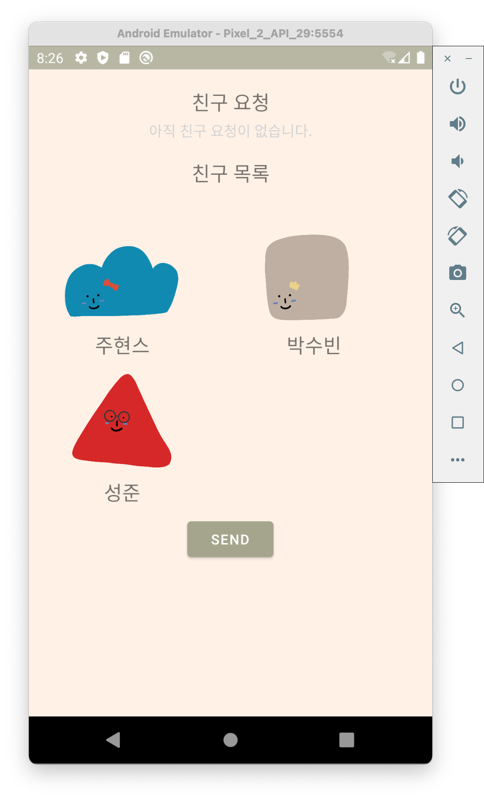
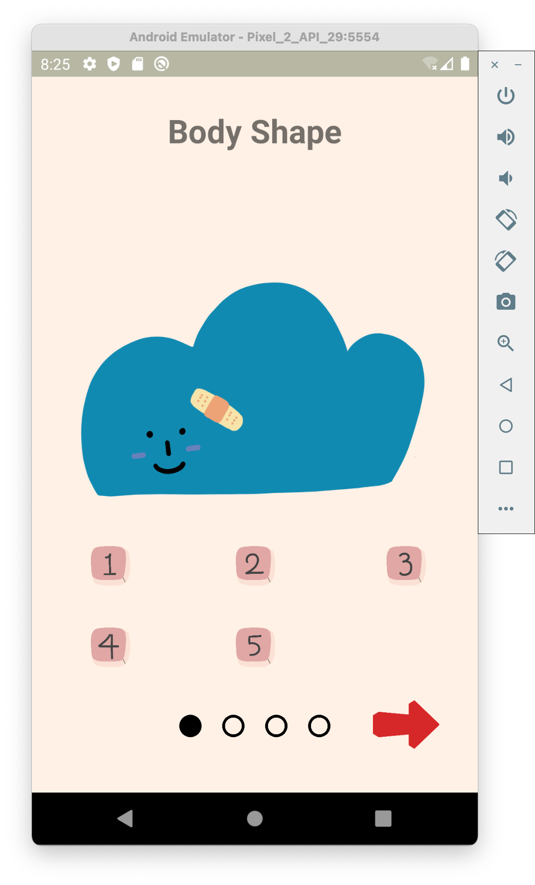
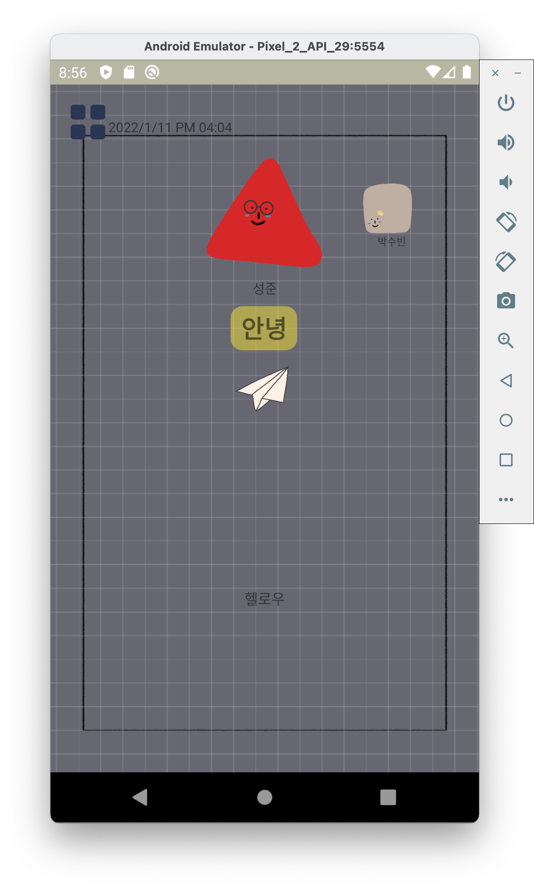
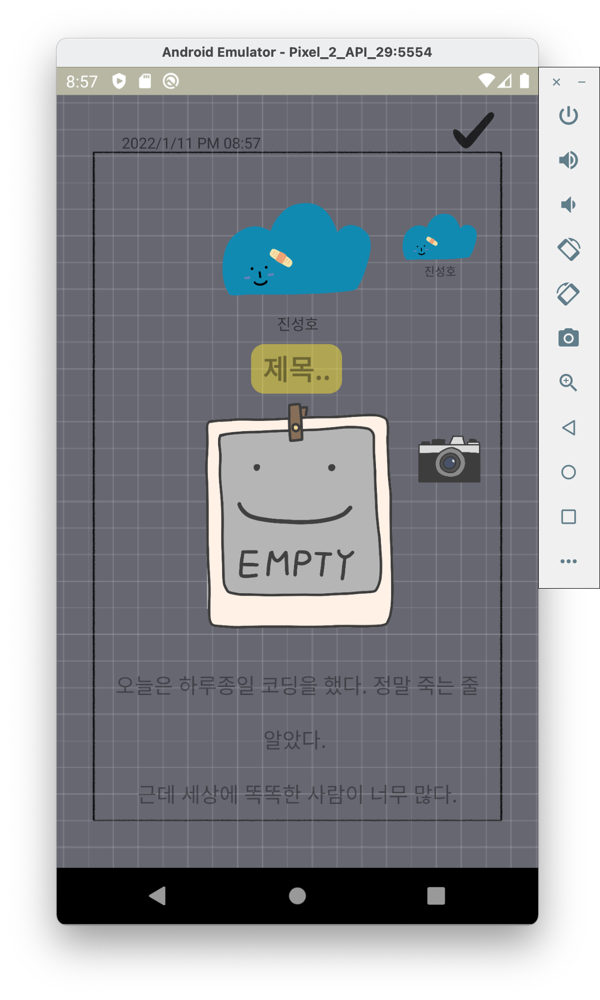
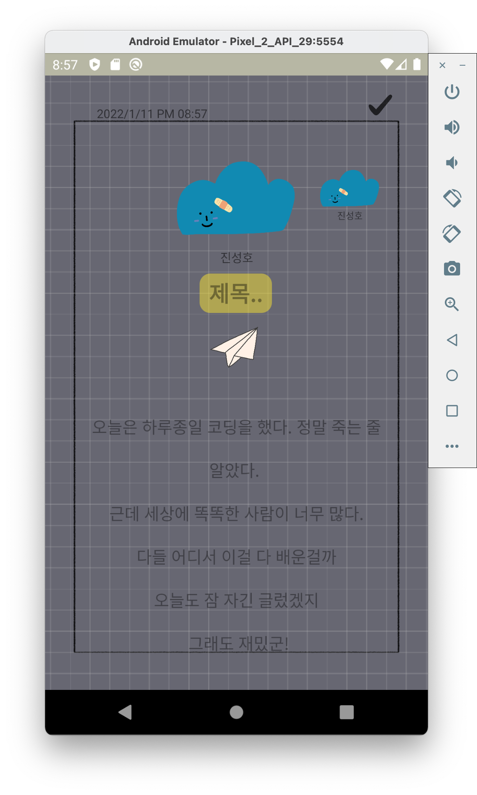

# camp-2-frontend
# 깐부일기
## 프로젝트 개요
## 프로젝트 구조
  - 메인 화면
  

  - 친구 신청 화면
  

  - 캐릭터 모양 변경 화면
  

  - 그림 일기 화면
  

  - 그림 일기 생성 화면
  

  - 일기 생성 화면
  

  - 그리드 뷰 화면 
## 프로젝트 개발 진행 과정
  - Backend : Express.js
  - Frotend : Kotlin + Android Studio
